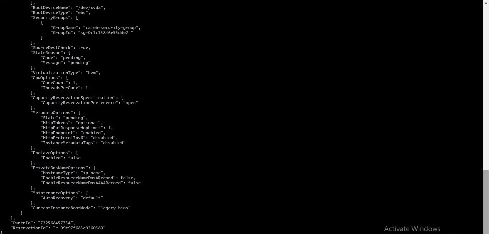
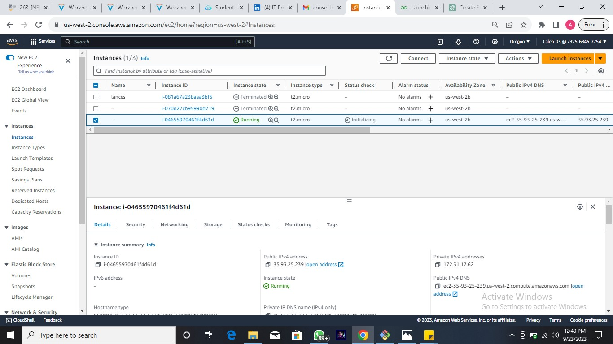

# EC2_INSTANCE

# How to launch an EC2 instance from the Command Line Interface

## Install AWS CLI (if not already installed):
if you haven't installed the AWS CLI on your computer, you can download and install it from the AWS official website.

## Configure AWS Credentials:
Configure your credentials by running this command on your terminal - 'aws configure'

## Create a Key Pair:
Use this command line to create a keypair
<aws ec2 create-key-pair --key-name YOURKEYPAIRNAME>

## Create a Security Group:
Use this line of command to create a Security Group
<aws ec2 create-security-group --group-name "security-group-name" --description "description">, note the "GroupId" given then run this command line 
<aws ec2 authorize-security-group-ingress --group-id "GroupId" --protocol tcp --port 22 --cidr 0.0.0.0/0>
                          

## Run your EC2 Inastance
Use this command line to run your EC2 
<aws ec2 run-instances --image-id "ami-id" --instance-type t2.micro --key-name "Keypair-name" --security-group-ids "SecurityGroupId">

## Verifying the EC2 Instance
To verify whether the EC2 instance created using the AWS CLI is created as per need, log in to your AWS Console and open the EC2 service and check for the instance.

